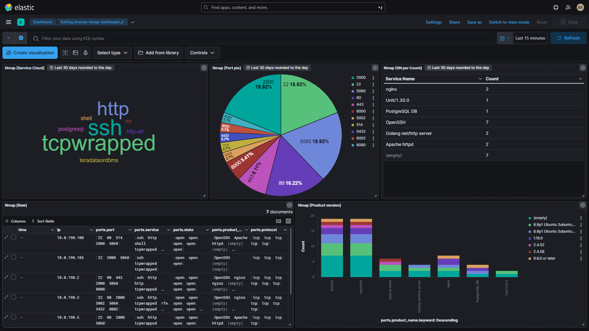

# Nmap scanner with export to Elastic

**Disclaimer**: This is a simple prototype made for the Information Technology Security class at FIIT STU. Use at your own risk.

This Python script serves as a vulnerability scanner that utilizes the nmap tool to scan for vulnerabilities in a target system. It then processes the output and sends it to Elastic Stack (Elasticsearch) for further analysis and visualization.

Note: Ensure that you have nmap installed on your system and that the Elasticsearch cluster is properly configured before running this script.

## Libraries used:
- nmap-python: A Python wrapper for the nmap network scanning tool.
- elasticsearch-py: A Python client for Elasticsearch, allowing communication with an Elasticsearch cluster.
- dotenv: A Python library for reading variables from .env files.

## Usage:
1. Install the required libraries by running `pip install nmap-python elasticsearch-py python-dotenv`.
2. Set up the necessary environment variables in a .env file. Example:
    ```
    ELASTIC_URL='http://localhost:9200'
    ELASTIC_USERNAME='elasticUser'
    ELASTIC_PASSWORD='veryStrongPassword'
    ELASTIC_INDEX='nmap_vuln_scanning'
    ```
3. Run the script and provide the user input in console
4. Script initiates the vulnerability scan and send the results to Elasticsearch.
5. Feel free to analyze the data in Kibana, create dashboards, whatever you feel like.

Example dashboard in Kibana created from the scan results:


This dashboard with the related objects is exported to `export.ndjson` file, you can import it to your Kibana instance and change it according to your needs.

Inspiration from repositories:
https://github.com/flover97/nmap-to-es-kibana
https://github.com/roligheten/nwatch
